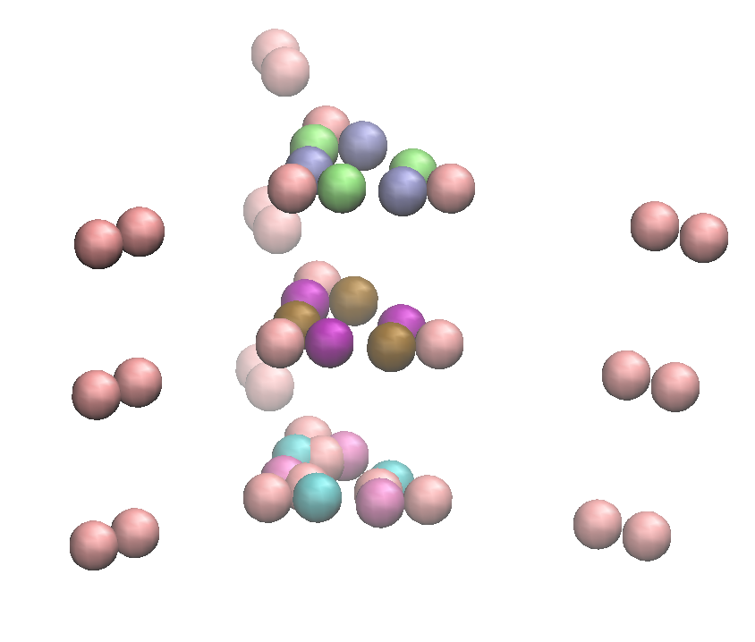

# Patchy particle simulation with Lammps

## Lammps installation
You will need `cmake>=3.12`. Below, I am going to install lammps using the clang compiler presets on macos. For patchy particle simulations, we need to include the `RIGID`, `MOLECULE` and `EXTRA-PAIR` package too.

```
git clone -b release --depth 1000 https://github.com/lammps/lammps.git lammps
cd lammps
mkdir build
cd build
cmake -C ../cmake/presets/clang.cmake  -D PKG_RIGID=yes -D PKG_MOLECULE=yes -D PKG_EXTRA-PAIR=yes ../cmake/
make
```

A successful installation will create the lammps executable in `./build/lmp`.

We use the RIGID body package in lammps to define our patchy particles. A patchy particle is rigid body composed of multiple particles (or interaction centres). We can define desired pair potentials between any two pairs of particles in two different rigid bodies. In the second example (i.e SAGE), we also define a bond between two rigid bodies.

## Examples

### Hexagonal sheet

- `generate_init_conf.m` is a MATLAB script to generate a lammps starting configuration
- `in.rigid` a lammps input script for defining the system and running the simulation. The pair-potential used for patchy particles is a hybrid LJ/morse potential.
- `last_conf_0.1` a sample lammps starting configuration.

```
cd hexagonal_sheet
~/lammps/build/lmp -in in.rigid -var T 0.01
```


### SAGE
The (`./sage/in.sage`) is on old lammps script (might be different from the SAGE [published potential](https://www.pnas.org/doi/suppl/10.1073/pnas.1706825114/suppl_file/pnas.1706825114.sapp.pdf)) for simulating the SAGE. I also included a consistent configuration for this potential (see `./sage/last_conf`). Note that for simulating a new patchy particle, you will always need to create a consistent starting configuration, ideally in a minimum energy configuration and without any overlap.

```
cd sage
~/lammps/build/lmp -in in.sage -var T 1.00
```

In this example, the simulation box contains a single hub. A hub is made of 48 atoms (or 6 rigid bodies) with 3 harmonic bonds connecting the trimer-forming (green) rigid body to the dimer-forming (red) one.




#### Visualisation
You can directly visualise the lamps trajectory in VMD. For a nicer visualisation you can use the `render_traj.py` script.
```
python render_traj.py dump_1.00.lammpstrj
```
This script creates tcl snapshots in the default folder `./render_output` (which can be changed using `--output` switch). To see a tcl file in VMD you can start VMD and then run the command `source filename.tcl` in the VMD consul.

Alternatively, you can ask the `render_traj.py` to automatically render all snapshots in the trajectory by
```
python render_traj.py dump_1.00.lammpstrj --render
```
Note that rendering can be quite slow for a large trajectory. The script uses the following default paths for the VMD and the tachyon renderer in macos:
```
"/Applications/VMD 1.9.4a57-x86_64-Rev12.app/Contents/MacOS/startup.command"

"/Applications/VMD 1.9.4a57-x86_64-Rev12.app/Contents/vmd/tachyon_MACOSXX86_64"
```
If you installed VMD in a different folder, you'd need to pass the correct paths via `--vmd_path` and `--tachyon_path` switches.

After rendering all tga snapshots are created in the output folder. `ffmpeg` and `convert` can be used to convert the images to png or to make a movie

```
ffmpeg -y -r 15 -i render_output/*.tga -c:v libx264 -r 45 -pix_fmt yuv420p movie.mp4
```